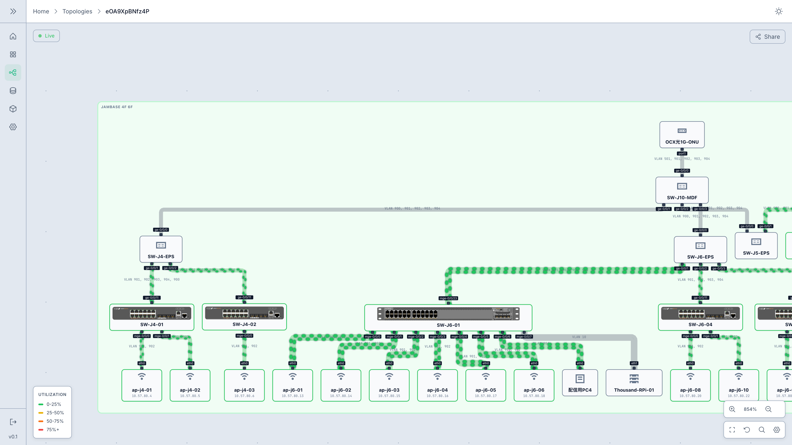
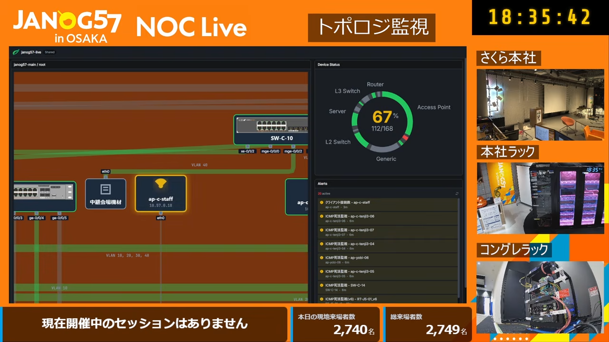

# Shumoku

> [!IMPORTANT]
> 製作者がJANOG57 NOCに参加中です。サーバー系機能のreadmeが全体的に整備されていません。何かあればご連絡ください。
> 📧 [contact@shumoku.dev](mailto:contact@shumoku.dev) / 𝕏 [@shumoku_dev](https://x.com/shumoku_dev)


**Network topology visualization and monitoring platform.** Define your network in YAML, get interactive diagrams with real-time metrics from Zabbix, Prometheus, and more.

[](https://opensource.org/licenses/MIT)
[](https://www.npmjs.com/package/shumoku)
[](https://buymeacoffee.com/akitoshi)

**[Website](https://www.shumoku.dev/)** | **[Server Documentation](https://www.shumoku.dev/ja/docs/server)**

<picture>
  
</picture>
<p align="center"><em>Topology viewer — live traffic utilization overlay with vendor icons</em></p>

<picture>
  
</picture>
<p align="center"><em>Dashboard in production — JANOG57 NOC Live</em></p>

## Features

- **Live weathermap** — Overlay real-time traffic utilization on links, color-coded by load
- **Alert visualization** — Show active alerts from Zabbix, Prometheus, and Grafana on topology
- **Auto-generate from NetBox** — Pull devices and cables from NetBox to build topology automatically
- **Interactive dashboards** — Pan, zoom, and drill into multi-layer network views in the browser
- **900+ vendor icons** — Yamaha, Aruba, AWS, Juniper, and more — rendered at correct aspect ratios
- **Shareable links** — Publish topology views with a share token — no login required

## Getting Started

See **[Server Setup Guide](apps/server/README.md)** for Docker, systemd, and manual deployment options.

### What You Can Do

1. **Create topologies** — Upload YAML files or write them in the built-in editor
2. **Connect data sources** — Link Zabbix, Prometheus, or NetBox to pull live metrics
3. **Monitor in real-time** — See node status and link utilization update live on your diagrams
4. **Build dashboards** — Combine multiple topologies and metric widgets into custom views
5. **Share** — Generate public links for read-only access without authentication

## Integrations

| | |
|---|---|
| **Zabbix** | Pull traffic metrics, host status, and alerts via JSON-RPC API |
| **Prometheus** | Query SNMP and node exporter metrics for link utilization |
| **Grafana** | Receive alerts via webhook and display them on topology |
| **NetBox** | Auto-discover topology from DCIM inventory and IPAM data |
| **REST API** | Render topologies and fetch metrics programmatically from your own tools |

## YAML Example

```yaml
name: "Simple Network"

settings:
  direction: TB
  theme: light

subgraphs:
  - id: core
    label: "Core Layer"

nodes:
  - id: rt-01
    label: "Router 01"
    type: router
    vendor: yamaha
    model: rtx3510
    parent: core

  - id: sw-01
    label: "Switch 01"
    type: l3-switch
    parent: core

links:
  - from:
      node: rt-01
      port: lan1
    to:
      node: sw-01
      port: ge-0/0/0
    bandwidth: 10G
```

## npm Library

The rendering engine is also available as standalone npm packages.


```bash
npm install shumoku
```

```typescript
import { YamlParser, HierarchicalLayoutEngine, SvgRenderer } from 'shumoku'

const graph = new YamlParser().parse(yamlString)
const layout = await new HierarchicalLayoutEngine().layout(graph)
const svg = new SvgRenderer().render(layout)
```

CLI is also available:

```bash
npx shumoku render network.yaml -o diagram.svg
npx shumoku render network.yaml -f html -o diagram.html
```

**[Playground](https://www.shumoku.dev/)** | **[npm Documentation](https://www.shumoku.dev/docs/npm/yaml-reference)**

<details>
<summary>Packages</summary>

| Package | Description |
|---------|-------------|
| [`shumoku`](packages/shumoku) | Main package (all-in-one) |
| [`@shumoku/core`](packages/@shumoku/core) | Core library (models, layout) |
| [`@shumoku/renderer`](packages/@shumoku/renderer) | SVG/HTML renderers + CLI |
| [`@shumoku/parser-yaml`](packages/@shumoku/parser-yaml) | YAML parser |
| [`@shumoku/icons`](packages/@shumoku/icons) | Vendor icons (Yamaha, Aruba, AWS, Juniper) |
| [`@shumoku/netbox`](packages/@shumoku/netbox) | NetBox API integration |

</details>

## Documentation

- [Server Guide](https://www.shumoku.dev/ja/docs/server) — Setup, data sources, dashboards
- [YAML Reference](https://www.shumoku.dev/docs/npm/yaml-reference) — Full YAML syntax
- [Vendor Icons](https://www.shumoku.dev/docs/npm/vendor-icons) — Available icons
- [Playground](https://www.shumoku.dev/) — Try without installation

## Development

```bash
git clone https://github.com/konoe-akitoshi/shumoku.git
cd shumoku
bun install
bun run build
bun run dev
```

## License

MIT
